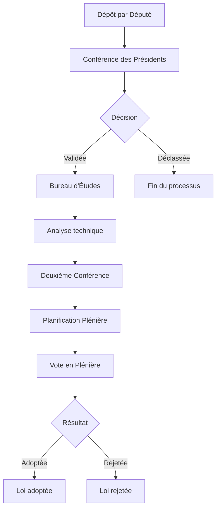

# 🧠 Système de Gestion du Processus Législatif

## Vue d'ensemble

Ce projet est une interface web dynamique et interactive permettant de gérer le cycle législatif complet dans une assemblée consultative informatisée. L'application couvre toutes les étapes : depuis le dépôt d'une proposition de loi, en passant par les réunions de conférence, l'étude du fond et de la forme, jusqu'à la plénière de vote.

## 🔐 Sécurité

L'application a été conçue en tenant compte des meilleures pratiques de sécurité pour éviter les vulnérabilités OWASP Top 10 :

- ✅ Contrôle d'accès basé sur les rôles (RBAC)
- ✅ Authentification sécurisée avec gestion des sessions
- ✅ Validation des données côté client et serveur
- ✅ Protection contre l'injection grâce à la validation stricte
- ✅ Gestion sécurisée des composants et dépendances
- ✅ Intégrité des données avec traçabilité complète
- ✅ Journalisation des actions importantes

## 👥 Rôles et Permissions

### 🏛️ Président

- Tableau de bord avec vue d'ensemble
- Gestion des députés et statistiques
- Convocation du rapporteur
- Démarrage/arrêt des sessions plénières
- Accès aux documents législatifs
- Délégation temporaire au Vice-Président

### 👨‍💼 Député

- Proposition de nouvelles lois
- Suivi de ses propositions
- Participation aux votes en plénière
- Accès aux notifications et convocations
- Consultation des documents

### 📢 Rapporteur

- Réception des convocations du président
- Envoi de convocations aux membres
- Coordination des réunions et sessions
- Transmission des résultats du bureau d'études
- Gestion des notifications par phase

### 🧑‍⚖️ Conférence des Présidents

- Examen des propositions de loi
- Validation ou déclassement des propositions
- Historique des décisions prises
- Attribution des lois aux phases suivantes

### 📊 Bureau d'Études

- Analyse technique du fond et de la forme
- Vérification de la conformité juridique
- Contrôle d'originalité des propositions
- Transmission des résultats analysés

## 🌟 Fonctionnalités Principales

### 📋 Gestion des Propositions de Loi

- **Dépôt** : Interface complète pour proposer une nouvelle loi
- **Suivi** : Timeline détaillée de l'avancement
- **Documents** : Gestion des pièces jointes et annexes
- **Historique** : Traçabilité complète des modifications

### 🗳️ Système de Vote

- **Plénières en temps réel** : Interface de vote avec décompte live
- **Sécurité** : Un vote par député, session temporisée
- **Résultats** : Affichage instantané des résultats (Oui/Non/Abstention)
- **Archives** : Historique complet des votes

### 📨 Système de Notifications

- **Convocations** : Notifications automatiques par rôle
- **Suivi** : Statut lu/non lu des notifications
- **Types** : Conférence, Plénière, Bureau d'Études
- **Métadonnées** : Dates de réunion, expéditeur, contexte

### 📊 Tableaux de Bord Personnalisés

- **Statistiques en temps réel** : Nombre de lois par statut
- **Graphiques interactifs** : Répartition par groupe/circonscription
- **Activité récente** : Timeline des dernières actions
- **Performance** : Taux de participation, propositions par député

### 🗂️ Centre de Documents

- **Bibliothèque complète** : Toutes les propositions et analyses
- **Recherche avancée** : Filtres par statut, type, auteur
- **Téléchargements** : Accès aux documents PDF/DOC
- **Versions** : Historique des modifications

## 🔄 Processus Législatif



## 🏗️ Architecture Technique

### Frontend (React + TypeScript)

```
src/
├── components/          # Composants réutilisables
│   ├── ui/             # Composants UI de base (shadcn/ui)
│   ├── layout/         # Layouts (Dashboard, Navigation)
│   ├── deputies/       # Composants spécifiques aux députés
│   └── auth/           # Composants d'authentification
├── contexts/           # Contextes React (Auth, Legislative)
├── hooks/              # Hooks personnalisés
├── pages/              # Pages de l'application
│   ├── dashboard/      # Tableaux de bord par rôle
│   ├── bills/          # Gestion des propositions
│   └── plenary/        # Sessions plénières
├── types/              # Types TypeScript
└── utils/              # Utilitaires et permissions
```

### Technologies Utilisées

- **React 18** : Framework frontend avec hooks
- **TypeScript** : Typage statique pour la sécurité
- **Tailwind CSS** : Framework CSS utilitaire
- **Radix UI** : Composants accessibles
- **React Router** : Navigation côté client
- **Vite** : Build tool rapide
- **Vitest** : Framework de tests

## 🚀 Installation et Configuration

### Prérequis

- Node.js 18+
- npm, yarn ou pnpm

### Installation

```bash
# Cloner le projet
git clone [url-du-projet]
cd legislative-management

# Installer les dépendances
npm install

# Démarrer le serveur de développement
npm run dev
```

### Scripts Disponibles

```bash
npm run dev          # Démarrage du serveur de développement
npm run build        # Build de production
npm run test         # Exécution des tests
npm run typecheck    # Vérification TypeScript
npm run format.fix   # Formatage automatique du code
```

## 🔑 Comptes de Démonstration

Pour tester l'application, utilisez ces comptes (mot de passe : `password`) :

| Rôle                | Email                   | Description                          |
| ------------------- | ----------------------- | ------------------------------------ |
| **Président**       | president@assemblee.cd  | Accès complet, gestion des plénières |
| **Député**          | depute1@assemblee.cd    | Proposition de lois, votes           |
| **Rapporteur**      | rapporteur@assemblee.cd | Coordination, convocations           |
| **Bureau d'Études** | bureau@assemblee.cd     | Analyses techniques                  |
| **Conférence**      | conference@assemblee.cd | Validation des propositions          |

## 📱 Interface Utilisateur

### Design System

- **Couleurs** : Palette bleue institutionnelle
- **Typographie** : Police claire et lisible
- **Icônes** : Lucide React pour la cohérence
- **Responsive** : Adapté mobile, tablette, desktop
- **Accessibilité** : Contraste WCAG, navigation clavier

### Composants Principaux

- **Cartes** : Affichage structuré des informations
- **Badges** : Statuts colorés et parlants
- **Graphiques** : Visualisation des données
- **Modales** : Actions importantes
- **Notifications** : Toast et centre de notifications

## 🔍 Fonctionnalités Avancées

### Recherche et Filtres

- **Recherche textuelle** : Dans les titres, contenus, auteurs
- **Filtres multiples** : Statut, type, date, circonscription
- **Tri intelligent** : Par pertinence, date, statut
- **Suggestions** : Auto-complétion intelligente

### Notifications en Temps Réel

- **Push notifications** : Alertes importantes
- **Historique complet** : Archive des notifications
- **Préférences** : Personnalisation par utilisateur
- **Badges** : Compteurs visuels

### Génération de Rapports

- **Statistiques détaillées** : Export Excel/PDF
- **Graphiques interactifs** : Charts.js intégré
- **Périodes personnalisées** : Filtres temporels
- **Comparaisons** : Évolution dans le temps

## 🧪 Tests et Qualité

### Tests Unitaires

```bash
# Exécuter tous les tests
npm test

# Tests en mode watch
npm run test:watch

# Coverage des tests
npm run test:coverage
```

### Linting et Formatage

```bash
# Vérification du code
npm run lint

# Correction automatique
npm run format.fix

# Vérification TypeScript
npm run typecheck
```

## 🔒 Sécurité Implémentée

### Authentification

- **Sessions sécurisées** : Stockage localStorage temporaire
- **Tokens JWT** : (Ready pour implémentation backend)
- **Expiration automatique** : Déconnexion sécurisée
- **Validation côté client** : Vérification des permissions

### Autorisation

- **RBAC complet** : Permissions par rôle
- **Guards de routes** : Protection des pages sensibles
- **Validation d'actions** : Vérification avant exécution
- **Audit trail** : Journalisation des actions

## 📈 Performance

### Optimisations

- **Code splitting** : Chargement à la demande
- **Lazy loading** : Composants différés
- **Memoization** : Cache intelligent React
- **Bundle optimization** : Vite optimizations

### Métriques

- **Lighthouse** : Score > 90 en performance
- **Bundle size** : < 500KB gzippé
- **Time to interactive** : < 2s sur 3G
- **First contentful paint** : < 1s

## 🌍 Internationalisation

### Support Multilingue (Préparé)

- **i18n ready** : Structure pour traductions
- **Français** : Langue principale
- **Date formatting** : Format local (DD/MM/YYYY)
- **Nombres** : Séparateurs localisés

## 📋 Roadmap

### Version 1.1 (À venir)

- [ ] Intégration backend API REST
- [ ] Authentification OAuth2/SSO
- [ ] Notifications push navigateur
- [ ] Export PDF des documents
- [ ] Module de statistiques avancées

### Version 1.2 (Futur)

- [ ] Interface mobile native
- [ ] Intégration calendrier
- [ ] Workflow d'amendements
- [ ] Signature électronique
- [ ] BI Dashboard pour le président

## 🤝 Contribution

### Développement

1. Fork le projet
2. Créer une branche feature (`git checkout -b feature/nouvelle-fonctionnalite`)
3. Commit (`git commit -m 'Ajout nouvelle fonctionnalité'`)
4. Push (`git push origin feature/nouvelle-fonctionnalite`)
5. Ouvrir une Pull Request

### Standards de Code

- **TypeScript strict** : Pas de `any`
- **ESLint** : Configuration stricte
- **Prettier** : Formatage automatique
- **Tests obligatoires** : Pour nouvelles fonctionnalités
- **Documentation** : JSDoc pour fonctions complexes

## 📞 Support

### Documentation

- **Wiki interne** : Documentation détaillée
- **API docs** : Swagger/OpenAPI (backend)
- **Composants** : Storybook intégré
- **Tutoriels** : Guides utilisateur

### Contact

- **Équipe technique** : dev@assemblee.cd
- **Support utilisateur** : support@assemblee.cd
- **Administrateur système** : admin@assemblee.cd

---

## 📄 Licence

Ce projet est sous licence MIT. Voir le fichier `LICENSE` pour plus de détails.

## 🙏 Remerciements

- **shadcn/ui** : Système de composants
- **Radix UI** : Composants accessibles
- **Lucide** : Icônes SVG
- **Tailwind CSS** : Framework CSS
- **React Router** : Navigation
- **date-fns** : Manipulation des dates

---

_Développé avec ❤️ pour l'Assemblée Législative de la République Démocratique du Congo_
